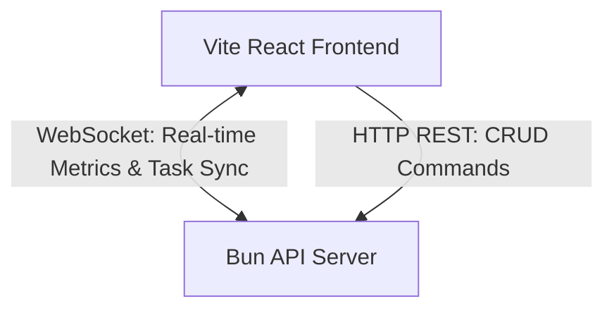

# AuraFlow: Real-Time Bun & Vite React Workspace

AuraFlow is a premium, full-stack, real-time metrics and project management dashboard. It uses a high-performance **Bun HTTP & WebSocket Server** backend and a modern, glassmorphic **Vite React & TypeScript** frontend.

---

## ⚡ Architecture Overview



### Key Highlights
*   **Orchestrated Startup**: Run both the server and client dev servers concurrently with a single command (`bun run dev`).
*   **Zero-Dependency Realtime Sync**: Leverages Bun's native WebSocket pub/sub system to propagate Kanban task updates and server performance stats across all open browser tabs instantly.
*   **Cyberpunk Design Aesthetic**: Styled using CSS variables, custom smooth transitions, glassmorphic panels, animated status indicators, and custom scrollbars.
*   **Diagnostics Suite**: Displays live JS Heap Memory, RSS allocations, WebSocket connections, and server uptime.
*   **Interactive Session Chat**: In-memory global chat logs that propagate in real time to all connected clients.

---

## 📂 Project Structure

```text
MyApp/
├── package.json           # Root workspace scripts
├── dev.ts                 # Dev server orchestrator script
├── README.md              # Documentation
├── server/
│   ├── index.ts           # Bun HTTP & WebSocket Server logic
│   ├── package.json       # Backend configurations & devDependencies
│   └── tsconfig.json      # TypeScript configurations for server
└── client/
    ├── index.html         # HTML entry point (SEO optimized)
    ├── package.json       # React & Vite client dependencies
    ├── vite.config.ts     # Vite configuration
    └── src/
        ├── main.tsx       # React mounting entry
        ├── App.tsx        # Dashboard interface (Kanban, metrics & chat)
        └── index.css      # Core premium design system stylesheet
```

---

## 🚀 Getting Started

### 1. Prerequisite
Ensure that [Bun](https://bun.sh) is installed on your system.

### 2. Run in Development Mode
To start both the Bun backend server and the Vite React client concurrently, run the following command in the project root:

```bash
bun run dev
```

The orchestrator will spin up:
*   **Bun Server**: [http://localhost:3001](http://localhost:3001)
*   **Vite Client**: [http://localhost:5173](http://localhost:5173) (or the next available port, e.g., `5174`)

### 3. Stop Dev Servers
Simply press `Ctrl+C` in your terminal. The orchestrator will catch the interrupt and cleanly terminate both backend and frontend processes.

---

## 🖥️ Desktop App (Electron)

A self-contained desktop wrapper lives in `desktop/`. It bundles the Bun-compiled
server with the built client into an Electron shell — no Bun or Node install
required on the target machine.

```
desktop/
├── electron/          # main process, preload, server-manager
├── scripts/           # build-server / build-client / verify
├── resources/         # generated: server binary + client bundle
├── package.json
├── tsconfig.json
└── electron-builder.yml
```

### First-time setup
```bash
bun install            # picks up the new desktop workspace
```

### Verify the build pipeline (no packaging)
```bash
bun run desktop:verify
```
This runs four steps and exits non-zero on the first failure:
1. `bun build --compile` → `desktop/resources/server/auraflow-server.exe`
2. `vite build` → stages `client/dist` next to the server binary
3. `tsc -p desktop/tsconfig.json --noEmit` → typechecks the Electron main/preload
4. Spawns the compiled server, hits `/` over loopback HTTP, asserts a 200 +
   real `<!doctype html>` body, then tears it down.

### Run the desktop app from source
```bash
bun run desktop:dev
```
This compiles the server, builds the client, then launches Electron pointed at
the local Bun server. The first launch creates `userData/.env` (template only —
fill in your `MONGODB_URI` and `PIN`).

### Package an installer
```bash
bun run desktop:build   # NSIS installer + portable .exe in desktop/release/
```

### Where things live at runtime
- `app.getPath("userData")/server.log` — server stdout/stderr
- `app.getPath("userData")/desktop.log` — Electron main-process log
- `app.getPath("userData")/.env` — user-editable env file

---

## 🔌 API Documentation

### REST HTTP Endpoints (`http://localhost:3001`)

| Method | Endpoint | Description |
| :--- | :--- | :--- |
| `GET` | `/api/metrics` | Fetches current system specs & memory diagnostics. |
| `GET` | `/api/tasks` | Retrieves all tasks in the Kanban board. |
| `POST` | `/api/tasks` | Creates a new task (expects JSON body). |
| `PUT` | `/api/tasks/:id` | Updates task status, title, description, or priority. |
| `DELETE` | `/api/tasks/:id` | Deletes a task by ID. |

### WebSocket Endpoint (`ws://localhost:3001/ws`)
Used for real-time notifications. On connection, the client subscribes to:
1.  `metrics` channel: Receives live performance stats updates every second.
2.  `activity` channel: Receives notifications on task alterations and global messages.

#### WebSocket Event Payloads
*   `{ type: "init", data: { metrics, tasks } }`: Initial state sent upon connection opening.
*   `{ type: "metrics", data: metrics }`: Broadcasted every 1s (includes RAM, Uptime, connection count).
*   `{ type: "task_created", data: task }`: Broadcasted when any user creates a task.
*   `{ type: "task_updated", data: task }`: Broadcasted when a task status shifts or details edit.
*   `{ type: "task_deleted", data: { id } }`: Broadcasted when a task is deleted.
*   `{ type: "chat_message", data: chatMessage }`: Broadcasted when a message is sent via session log.

---

## 🎨 Theme & Customization
Styling tokens are defined as CSS variables at the top of [client/src/index.css](file:///C:/Users/sanpa/OneDrive/Desktop/Fun%20projects/MyApp/client/src/index.css):
*   To edit the cyberpunk accents, update `--primary` (violet), `--secondary` (cyan), or `--accent` (rose).
*   To modify fonts, update `--font-heading` (`Outfit`) or `--font-body` (`Plus Jakarta Sans`).
