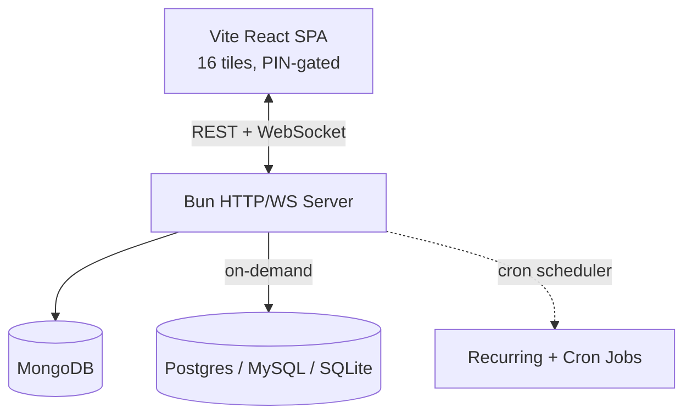

# AuraFlow — Developer Utility Portal

A self-hosted, cyberpunk-themed dashboard that bundles **16 developer tools** behind a single PIN-locked grid. One Bun server serves a Vite/React SPA and a WebSocket-realtime API; everything you reach for day-to-day — API testing, SQL/NoSQL clients, JSON tooling, a Kanban board, cron triggers, a password generator — lives one click away.

Live at **[portal.sanketpatel.online](https://portal.sanketpatel.online)**.

---

## ✨ What's inside

The portal is a grid of tiles. Each tile opens a full-screen tool. Some run entirely in the browser (no server round-trip); others talk to the backend over a bearer-token API.

| Tile | What it does | Type |
| :--- | :--- | :--- |
| **GitHub Finder** | Find open-source repos with open issues and contribution signals | Server |
| **Expense Tracker** | Track spending by category with a CLI-style interface | Server |
| **NoSQL Client** | Browse, filter and edit MongoDB collections | Server |
| **SQL Client** | Read-only SQL client for Postgres, MySQL and SQLite | Server |
| **Postman** | Construct and send REST API requests to any endpoint | Server |
| **Writing Agent** | Clean up the grammar, style and tone of text | Server |
| **Kanban Board** | Drag-and-drop task board with a copyable To Do list | Server + WS |
| **Cron Trigger** | Schedule API triggers and manage mock endpoints | Server |
| **Time & Cal** | Clock, timer, alarm and calendar in one view | Server |
| **Bookmark Manager** | Save and tag website links for quick recall | Server |
| **Picker Wheel** | Spin a weighted wheel to pick a random option | Client-only |
| **JSON Toolkit** | Format/minify JSON, encode Base64/URL, SHA-256/1/512 hashing | Client-only |
| **Pomodoro** | Focus timer with automatic break cycling and a progress ring | Client-only |
| **Regex Tester** | Test patterns with live match highlighting and capture groups | Client-only |
| **Password Gen** | Cryptographically secure passwords with entropy strength meter | Client-only |
| **Color Palette** | Color harmonies, HEX/RGB/HSL conversions, WCAG contrast checker | Client-only |

**Client-only** tiles persist their state to `localStorage` and work offline.

---

## ⚡ Architecture



- **One process does both jobs.** In production the Bun server serves the built SPA (static files from `client/dist`) *and* the API + WebSocket from a single port — no separate frontend server needed.
- **Realtime sync.** Bun's native WebSocket pub/sub propagates Kanban changes, server metrics and session chat across all open tabs instantly.
- **Code-split tiles.** Every tile is a lazy-loaded React chunk, so the initial PIN-screen payload stays small.
- **Resilient.** A top-level `try/catch` around the route loop returns clean JSON 500s, global `unhandledRejection`/`uncaughtException` handlers keep the process up, and SIGTERM triggers a graceful drain on deploys.
- **Cyberpunk aesthetic.** Dark glassmorphic panels, monospace type, animated transitions, custom scrollbars.

---

## 📂 Project Structure

```text
MyApp/
├── package.json              # Root workspace: dev, build, lint, desktop scripts
├── dev.ts                    # Concurrent dev-server orchestrator
├── server/
│   ├── index.ts              # Bun.serve: routing, WebSocket, static SPA
│   ├── env.ts                # .env resolution (dev, bundle, desktop layouts)
│   ├── db.ts                 # MongoDB connection
│   ├── scheduler.ts          # Recurring + cron job runner
│   ├── rate-limit.ts         # Per-IP request throttling
│   ├── http-context.ts       # Shared auth + CORS + response helpers
│   └── routes/               # API handlers: tasks, sql, nosql, github, etc.
├── client/
│   ├── index.html            # HTML entry
│   ├── vite.config.ts        # Vite + React + Tailwind
│   └── src/
│       ├── App.tsx           # Portal grid + tile routing + PIN gate
│       ├── env.ts            # Runtime API/WS URL resolution
│       ├── components/        # One file per tile (16 components)
│       ├── components/ui/     # Shared primitives: AppButton, AppInput, icons…
│       ├── hooks/             # usePersistentState, useAuthHeaders…
│       └── lib/               # utils, audio, form-validation, ui-classes
├── shared/validation/         # Zod schemas shared by client + server
├── deploy/                    # systemd unit + VPS deploy script
└── desktop/                   # Electron wrapper (see below)
```

---

## 🚀 Getting Started

### Prerequisites
- [Bun](https://bun.sh) installed
- A `.env` in `server/` (copy from `server/.env.example`): `MONGODB_URI`, `PIN`, and any tool-specific vars

### Development
```bash
bun install
bun run dev
```
Spins up both processes concurrently:
- **Bun API + WebSocket server** → `http://localhost:3001`
- **Vite dev server** (HMR) → `http://localhost:5173`

Press `Ctrl+C` to stop both.

### Production build
```bash
bun run build        # vite build (client/dist) + bun build (server bundle)
bun run start:bundle # runs the bundled server/dist/index.js (--smol heap)
```
The single Bun process then serves the API, WebSocket, *and* the static SPA on one port.

### Other scripts
```bash
bun run lint          # biome check
bun run check-types   # tsc on server + client
bun run format        # biome format --write
```

---

## 🔌 API

All `/api/*` routes (except `/api/verify-pin` and `/api/cron-mocks/`) require a `Authorization: Bearer <token>` header, where the token is issued after PIN verification.

| Method | Endpoint | Purpose |
| :--- | :--- | :--- |
| `POST` | `/api/verify-pin` | Exchange a PIN for a bearer token |
| `GET` | `/api/metrics` | Live system memory, RSS, uptime, WS connections |
| `GET/POST/PUT/DELETE` | `/api/tasks` | Kanban board CRUD |
| `GET/POST/PUT/DELETE` | `/api/expenses` | Expense tracker CRUD |
| `GET/POST` | `/api/bookmarks` | Bookmark manager |
| `POST` | `/api/sql/query` | Read-only SQL queries (Postgres/MySQL/SQLite) |
| `POST` | `/api/nosql/*` | MongoDB collection browse/edit |
| `POST` | `/api/postman/request` | Proxy an arbitrary REST request |
| `POST` | `/api/writing/process` | Grammar/style cleanup |
| `GET` | `/api/github/repos` | GitHub repo search |
| `GET/POST` | `/api/cron-mocks/*` | Mock cron-trigger endpoints |

**WebSocket** `ws://<host>/ws?token=<token>` — subscribes to:
- `metrics` — server stats broadcast every 2.5s
- `activity` — task/chat change events in real time
- `chat_message` — global session chat (in-memory)

---

## 🔐 Authentication

The portal uses a **PIN gate**, not user accounts:
1. The browser `POST`s the PIN to `/api/verify-pin`.
2. On success it receives a bearer token, stored in `localStorage`.
3. Every subsequent API call (REST + WebSocket) carries that token.

This keeps the portal a private single-user console — appropriate for a personal dev dashboard. The token is stateless (validated server-side each request).

---

## 🖥️ Desktop App (Electron)

A self-contained desktop wrapper lives in `desktop/`. It bundles the Bun-compiled server with the built client into an Electron shell — no Bun or Node install required on the target machine.

```bash
bun install               # picks up the desktop workspace
bun run desktop:verify    # build + typecheck + smoke-test (no packaging)
bun run desktop:dev       # run from source (compiles server, builds client, launches Electron)
bun run desktop:build     # NSIS installer + portable .exe in desktop/release/
```

**Runtime files** (under Electron's `userData` dir):
- `server.log` — server stdout/stderr
- `desktop.log` — Electron main-process log
- `.env` — user-editable env file (template created on first launch)

---

## 🚢 Deployment

Production runs on an Oracle Cloud VPS (1 GB RAM, Ubuntu). Deploys are **CI/CD-driven via Woodpecker CI** — pushing to `main` triggers a VPS-native build + atomic deploy:

```text
git push origin main
  → Woodpecker clones on the VPS
  → bun install + build (client + server bundle)
  → stages artifact to /opt/auraflow-release-incoming/
  → activate script: preserve .env, atomic swap incoming→active, chown, restart
  → Caddy fronts the single Bun process at portal.sanketpatel.online
```

The server runs as a `systemd` service (`auraflow.service`) with `bun --smol` to cap heap. See [`deploy/`](deploy/) for the unit file and deploy script. Manual rollback is a one-liner (swap `auraflow-prev` back).

---

## 🎨 Theme & Customization

Styling uses CSS variables at the top of [`client/src/index.css`](client/src/index.css):
- **Accents** — update the primary/secondary/accent color tokens.
- **Typography** — swap the heading and body font families.
- **Tile icons** — each tile has a hand-drawn SVG in [`client/src/components/ui/AppIcons.tsx`](client/src/components/ui/AppIcons.tsx).

---

## 🛠️ Tech Stack

| Layer | Choice |
| :--- | :--- |
| Runtime | [Bun](https://bun.sh) |
| Server | Bun.serve (HTTP + WebSocket, single process) |
| Frontend | React 19, Vite, TypeScript, Tailwind v4 |
| State | React hooks + `localStorage` persistence |
| Database | MongoDB (primary), Postgres/MySQL/SQLite (query clients) |
| Validation | Zod (shared schemas) |
| Desktop | Electron |
| CI/CD | Woodpecker CI (VPS-native) |
| Linting | Biome |

---

## 📄 License

Personal project — not currently licensed for redistribution.
